# Product Requirements Document
## Hệ thống Du lịch Thông minh — Vinh Khánh Smart Tourism

**Phiên bản:** 1.0  
**Ngày:** 09/04/2026  
**Trạng thái:** Draft

---

## 1. Tổng quan sản phẩm

### 1.1 Mô tả

Vinh Khánh Smart Tourism là nền tảng du lịch thông minh tích hợp ba thành phần:

- **App di động (MAUI Android)** — dành cho du khách, hỗ trợ bản đồ POI, audio guide tự động kích hoạt theo vị trí GPS, đa ngôn ngữ.
- **Dashboard Web (ASP.NET)** — dành cho Admin quản lý hệ thống và Chủ gian hàng quản lý nội dung POI của mình.
- **Backend API (ASP.NET Core)** — xử lý toàn bộ nghiệp vụ: gian hàng, món ăn, access session, thiết bị, TTS, auth.

### 1.2 Mục tiêu sản phẩm

| Mục tiêu | Chỉ số đo lường |
|---|---|
| Du khách khám phá POI không cần hướng dẫn viên | % POI có audio guide đầy đủ ≥ 80% |
| Chủ gian hàng tự quản lý nội dung | Thời gian onboard ≤ 3 ngày |
| Admin kiểm soát chất lượng gian hàng | Tỉ lệ duyệt/từ chối có email thông báo = 100% |
| Trải nghiệm offline | App hoạt động với cache SQLite khi mất mạng |

### 1.3 Các bên liên quan

| Vai trò | Mô tả |
|---|---|
| **Du khách** | Người dùng app, quét QR tại POI, nghe audio guide |
| **Chủ sở hữu (Owner)** | Đăng ký gian hàng, quản lý POI và món ăn, gia hạn subscription |
| **Admin** | Duyệt/từ chối gian hàng, quản lý toàn hệ thống |
| **Thiết bị QR** | Thiết bị vật lý đặt tại POI, được Admin kích hoạt |

---

## 2. Kiến trúc hệ thống

### 2.1 Stack công nghệ

| Thành phần | Công nghệ |
|---|---|
| Mobile App | .NET MAUI (Android) |
| Backend API | ASP.NET Core (.NET 10), MySQL |
| Admin/Owner Dashboard | ASP.NET (Razor Pages / API) |
| Maps | Microsoft.Maui.Maps (Google Maps Android) |
| TTS | Google Cloud Text-to-Speech API |
| Audio Playback | Plugin.Maui.Audio |
| Geofence | MAUI Geolocation (polling 3s, radius 10m) |
| Local Cache | SQLite (12h TTL) |
| Auth | JWT / Session-based |

### 2.2 Các entity chính (từ DB schema)

- `gianhang` — gian hàng / POI
- `gianhangngonngu` — bản dịch tên, mô tả, audioURL theo ngôn ngữ
- `monan` — món ăn thuộc gian hàng
- `ngonngu` — danh sách ngôn ngữ hỗ trợ
- `taikhoan` — tài khoản (admin / chu_quan_ly)
- `chuquanly` — chủ sở hữu
- `thietbi` — thiết bị QR tại POI
- `phien_vao_app` — access session sau khi quét QR
- `hinhanhgianhang`, `hinhanhmonan` — hình ảnh

### 2.3 Sơ đồ use case tổng thể



---

## 3. Tính năng theo vai trò

### 3.1 Du khách (Mobile App)

#### F01 — Bản đồ POI
- Xem bản đồ với các pin POI (gian hàng đang hoạt động có tọa độ lat/lon)
- Highlight POI gần nhất, xem chi tiết (tên, địa chỉ, mô tả, ảnh, danh sách món ăn)
- Tìm kiếm POI theo tên, món ăn, địa chỉ
- Xem vị trí hiện tại của mình trên bản đồ

#### F02 — Geofence + Audio Guide tự động
- Geofence polling 3 giây, radius 10m
- Khi vào vùng POI: tự động schedule phát audio sau 3 giây
- Hỗ trợ pause/resume, seek, stop
- Banner hiển thị trạng thái phát (Pending → Playing → Paused)
- Phát đúng ngôn ngữ người dùng đang chọn

#### F03 — Đa ngôn ngữ
- Chuyển đổi ngôn ngữ (vi, en, ...) trên giao diện
- Audio guide và mô tả POI theo ngôn ngữ được chọn
- Cache dữ liệu theo từng ngôn ngữ

#### F04 — Quét QR tại POI
- Quét mã QR của thiết bị đặt tại POI
- Gửi `POST /api/access/scan` → nhận `accessToken`
- Mở khóa nội dung POI trong session (mặc định 30 phút)
- Tùy chọn: nhập email để nhận hóa đơn

#### F05 — Offline Mode
- Cache AppData (gian hàng + món ăn) vào SQLite, TTL 12 giờ
- Khi mất mạng: fallback đọc từ SQLite
- Khi có mạng: ưu tiên gọi API, cập nhật cache

#### F06 — Tài khoản (tùy chọn)
- Đăng ký / đăng nhập
- Xem lịch sử POI đã ghé thăm (nếu có tài khoản)

---

### 3.2 Chủ sở hữu (Owner Dashboard)

#### F07 — Đăng ký tài khoản
- Điền form đăng ký → tạo tài khoản → xác thực email
- Sau xác thực: được phép tạo gian hàng

#### F08 — Đăng ký gian hàng
- Điền thông tin: tên, địa chỉ, mô tả, ảnh, lat/lon
- Gian hàng tạo xong ở trạng thái `cho_duyet`
- Hệ thống thông báo Admin có gian hàng mới chờ duyệt
- Chủ xem được trạng thái chờ duyệt ngay trên dashboard

#### F09 — Quản lý gian hàng
- Xem danh sách gian hàng của mình
- Cập nhật thông tin, ảnh, mô tả
- Thay đổi trạng thái (tạm dừng / hoạt động — chỉ khi đã được duyệt)
- Xem chi tiết theo từng ngôn ngữ

#### F10 — Quản lý món ăn
- Thêm / sửa / xóa món ăn thuộc gian hàng
- Cập nhật tên, giá, mô tả, ảnh, trạng thái hiển thị
- Đa ngôn ngữ cho tên và mô tả món ăn

#### F11 — Quản lý audio guide
- Nhập/chỉnh sửa mô tả gian hàng (theo từng ngôn ngữ)
- Kích hoạt sinh audio TTS từ mô tả (`POST /api/gianhang/{id}/generate-audio`)
- Audio được lưu file trên server, URL lưu vào DB
- Nếu mô tả thay đổi: audio cũ bị xóa, tạo lại tự động (`PUT /api/gianhang/{id}/update-mo-ta`)

#### F12 — Gia hạn subscription
- Xem danh sách hóa đơn
- Nhận thông báo sắp hết hạn (tự động trước N ngày)
- Bấm thanh toán → redirect đến cổng payment → webhook xác nhận → cập nhật trạng thái gian hàng → gửi email hóa đơn

---

### 3.3 Admin Dashboard

#### F13 — Duyệt gian hàng
- Xem danh sách gian hàng chờ duyệt
- Xem chi tiết gian hàng (thông tin, ảnh, tài liệu)
- Duyệt → cập nhật `hoat_dong`, gửi email thông báo chủ
- Từ chối + lý do → cập nhật `tu_choi`, gửi email kèm lý do

#### F14 — Quản lý gian hàng (toàn hệ thống)
- Xem tất cả gian hàng (lọc theo danh mục, trạng thái)
- Tạo / sửa gian hàng thay mặt owner
- Gán chủ quản lý theo email hoặc ID

#### F15 — Quản lý thiết bị QR
- Xem danh sách thiết bị
- Kích hoạt thiết bị: nhập `maKichHoat` → `POST /api/device/activate`
- Xem trạng thái thiết bị (đã kích hoạt, lần cuối hoạt động)

#### F16 — Tổng quan (Dashboard)
- Số gian hàng đang hoạt động / chờ duyệt / tạm dừng
- Số chủ sở hữu
- Analytics cơ bản (lượt quét QR, POI phổ biến nhất — roadmap)

---

## 4. API Endpoints tổng hợp

### Auth
| Method | Endpoint | Mô tả |
|---|---|---|
| POST | `/api/auth/login` | Đăng nhập, trả JWT / session |

### GianHang (Public)
| Method | Endpoint | Mô tả |
|---|---|---|
| GET | `/api/gianhang/appdata?lang=vi` | Lấy toàn bộ data app (gian hàng + món ăn) |
| GET | `/api/gianhang` | Danh sách gian hàng |
| GET | `/api/gianhang/{id}` | Chi tiết gian hàng |
| GET | `/api/gianhang/nearby?lat&lon&radiusMeters` | Gian hàng gần vị trí |
| POST | `/api/gianhang/{id}/generate-audio` | Sinh audio TTS từ mô tả |
| PUT | `/api/gianhang/{id}/update-mo-ta` | Cập nhật mô tả + tái sinh audio |

### POI
| Method | Endpoint | Mô tả |
|---|---|---|
| GET | `/api/poi?lang=vi` | Danh sách POI có tọa độ |

### Access (QR Session)
| Method | Endpoint | Mô tả |
|---|---|---|
| POST | `/api/access/scan` | Quét QR → tạo access session |
| GET | `/api/access/validate?accessToken=` | Kiểm tra session còn hiệu lực |

### Device
| Method | Endpoint | Mô tả |
|---|---|---|
| POST | `/api/device/activate` | Kích hoạt thiết bị QR |
| GET | `/api/device/{maThietBi}/status` | Trạng thái thiết bị |

### Owner
| Method | Endpoint | Mô tả |
|---|---|---|
| GET | `/api/owner/stores?idTaiKhoan=` | Gian hàng của owner |
| GET | `/api/owner/stores/{id}` | Chi tiết gian hàng |
| POST | `/api/owner/stores` | Tạo gian hàng |
| PUT | `/api/owner/stores/{id}` | Cập nhật gian hàng |
| POST | `/api/owner/stores/{id}/image` | Upload ảnh gian hàng |
| PATCH | `/api/owner/stores/{id}/status` | Đổi trạng thái gian hàng |
| GET | `/api/owner/stores/{id}/foods` | Danh sách món ăn |
| POST | `/api/owner/foods` | Tạo món ăn |
| PUT | `/api/owner/foods/{id}` | Cập nhật món ăn |
| PATCH | `/api/owner/foods/{id}/status` | Đổi trạng thái món ăn |

### Admin
| Method | Endpoint | Mô tả |
|---|---|---|
| GET | `/api/admin/summary` | Tổng quan hệ thống |
| GET | `/api/admin/stores` | Toàn bộ gian hàng |
| GET | `/api/admin/owners` | Danh sách owners |
| POST | `/api/admin/stores` | Tạo gian hàng (gán owner theo email/id) |
| PUT | `/api/admin/stores/{id}` | Cập nhật gian hàng |
| PATCH | `/api/admin/stores/{id}/status` | Duyệt / từ chối / tạm dừng |
| POST/PUT/PATCH | `/api/admin/foods/*` | Quản lý món ăn toàn hệ thống |

---

## 5. Trạng thái gian hàng (State Machine)

```
cho_duyet → hoat_dong (Admin duyệt)
cho_duyet → tu_choi   (Admin từ chối)
hoat_dong → tam_dung  (Owner hoặc Admin tạm dừng)
tam_dung  → hoat_dong (Owner hoặc Admin kích hoạt lại)
```

Chỉ các gian hàng `hoat_dong` mới xuất hiện trong AppData trả về cho App.

---

## 6. Sequence Diagrams (tổng hợp)

### 6.1 Đăng nhập và phân quyền



### 6.2 Geofence và audio guide tự động



### 6.3 Quét QR và kích hoạt phiên truy cập



### 6.4 Đồng bộ và cache offline



### 6.5 Chủ sở hữu quản lý gian hàng



### 6.6 Quản lý món ăn



---

## 7. Yêu cầu phi chức năng

| Hạng mục | Yêu cầu |
|---|---|
| **Hiệu năng** | API AppData phản hồi < 500ms (cached), < 2s (cold) |
| **Offline** | App đọc được dữ liệu từ SQLite khi không có mạng |
| **Bảo mật** | Xác thực idTaiKhoan trên mọi endpoint Owner/Admin |
| **Đa ngôn ngữ** | Tối thiểu vi, en; mở rộng thêm ngôn ngữ qua bảng ngonngu |
| **Audio** | TTS Google Cloud; cache audioURL trong DB (không sinh lại nếu đã có) |
| **Geofence** | Polling 3s, radius mặc định 10m (configurable) |

---

## 8. Roadmap

| Giai đoạn | Tính năng |
|---|---|
| **MVP (hiện tại)** | Bản đồ POI, geofence audio, QR session, quản lý gian hàng/món ăn, TTS, admin duyệt |
| **v1.1** | Thanh toán subscription (Payment integration), email thông báo đầy đủ |
| **v1.2** | Analytics (heatmap, top POI, thống kê lượt quét), tour guide script |
| **v2.0** | Đa ngôn ngữ mở rộng, OCR tự động từ ảnh menu, AI gợi ý tour |

---

*Tài liệu này được tổng hợp từ source code (C-SA-T MAUI App + VinhKhanh ASP.NET Backend), sequence diagrams thiết kế, và ghi chú phát triển.*
